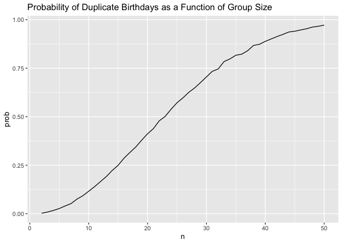

P8105 Homework 5
================
Maya Krishnamoorthy
2024-11-13

## Problem 1

Suppose you put 𝑛 people in a room, and want to know the probability
that at least two people share a birthday. For simplicity, we’ll assume
there are no leap years (i.e. there are only 365 days) and that
birthdays are uniformly distributed over the year (which is actually not
the case).

``` r
bday_sim = function(n) {
  
  bdays = sample(1:365, size = n, replace = TRUE)
  
  duplicate = length(unique(bdays)) < n
  
  return(duplicate)
}
```

``` r
sim_res = 
  expand_grid(
    n = 2:50,
    iter = 1:10000
  ) |> 
  mutate(res = map_lgl(n, bday_sim)) |> 
  group_by(n) |> 
  summarize(prob = mean(res))

sim_res |> 
  ggplot(aes(x = n, y = prob )) + 
  geom_line() +
  labs(
    title = "Probability of Duplicate Birthdays as a Function of Group Size"
  )
```

<!-- -->

The probability of having a duplicate birthday increases as the group
size increases. For small group sizes, the probability of a duplicate
birthday is close to zero. It starts off very low because with fewer
people, the chance of having a matching birthday is small. As the group
size approaches 50, the probability approaches 1 (or 100%) meaning that
it is almost certain that there will be at least one pair of people that
share a birthday.

## Problem 2
