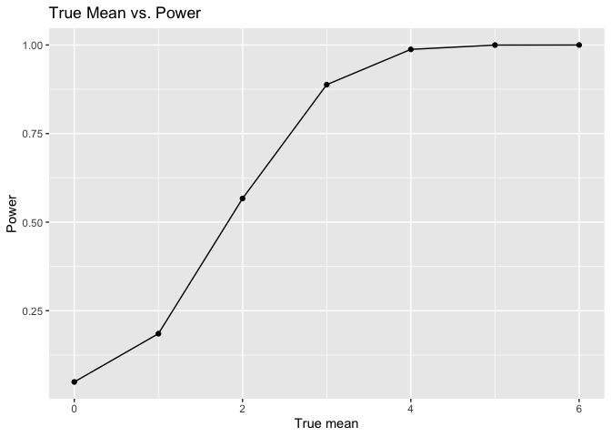

P8105 Homework 5
================
Maya Krishnamoorthy
2024-11-13

## Problem 1

Suppose you put 𝑛 people in a room, and want to know the probability
that at least two people share a birthday. For simplicity, we’ll assume
there are no leap years (i.e. there are only 365 days) and that
birthdays are uniformly distributed over the year (which is actually not
the case).

``` r
bday_sim = function(n) {
  
  bdays = sample(1:365, size = n, replace = TRUE)
  
  duplicate = length(unique(bdays)) < n
  
  return(duplicate)
}
```

``` r
sim_res = 
  expand_grid(
    n = 2:50,
    iter = 1:10000
  ) |> 
  mutate(res = map_lgl(n, bday_sim)) |> 
  group_by(n) |> 
  summarize(prob = mean(res))

sim_res |> 
  ggplot(aes(x = n, y = prob )) + 
  geom_line() +
  labs(
    title = "Probability of Duplicate Birthdays as a Function of Group Size"
  )
```

<!-- -->

The probability of having a duplicate birthday increases as the group
size increases. For small group sizes, the probability of a duplicate
birthday is close to zero. It starts off very low because with fewer
people, the chance of having a matching birthday is small. As the group
size approaches 50, the probability approaches 1 (or 100%) meaning that
it is almost certain that there will be at least one pair of people that
share a birthday.

## Problem 2

**Conduct a simulation to explore power in a one-sample t-test.**

Set initial variables.

``` r
n = 30
sigma = 5
mu = 0
reps = 5000
alpha = 0.05
```

Generate 5000 datasets from the normal model.

``` r
sim_data <- tibble(
  id = integer(reps),
  sample = vector("list", reps)
)

for (i in 1:reps) {
  sim_data$id[i] = i
  sim_data$sample[[i]] = rnorm(n, mean = mu, sd = sigma)
}
```

Save mu-hat and the p-value evaluated from a t-test with a null
hypothesis where `mu` = 0 using `alpha` = 0.05.

``` r
results_df = 
  sim_data |> 
  mutate(
    mu_hats = map_dbl(sample, mean),
    t_test = map(sample, \(x) broom::tidy(t.test(x, mu = 0, conf.level = 0.95))),
    p_values = map_dbl(t_test, \(x) x$p.value)
  ) |> 
  select(id, mu_hats, p_values)
```

**Repeat the above for mu = {1,2,3,4,5,6}.**

Step 1: Create a function that evaluates for each value of mu.

``` r
get_data = function(true_mean, n = 30, sigma = 5, reps = 5000) {
  # Create dataset of samples for each mu.
  sim_data <- tibble(
    id = integer(reps),
    sample = vector("list", reps)
  )
  
  for (i in 1:reps) {
    sim_data$id[i] = i
    sim_data$sample[[i]] = rnorm(n, mean = true_mean, sd = sigma)
  }
  
  # Calculate mu-hats and p-values per sample.
  results_df = 
  sim_data |> 
  mutate(
    mu_hats = map_dbl(sample, mean),
    t_test = map(sample, \(x) broom::tidy(t.test(x, conf.level = 0.95))),
    p_values = map_dbl(t_test, \(x) x$p.value)
  ) |> 
  select(id, mu_hats, p_values)
  
  return(results_df)
}
```

Step 2: Create a table for each value of mu.

``` r
true_means = c(0, 1, 2, 3, 4, 5, 6)

final_df = 
  tibble(
    mu = true_means,
    results = map(true_means, \(x) get_data(true_mean = x))
  ) |> 
  unnest(results) |> 
  select(-id)
```

**Make a plot showing the proportion of times the null was rejected (the
power of the test) on the y axis and the true value of mu on the x
axis.**

``` r
final_df |> 
  group_by(mu) |>
  summarize(
    prop_rejected = mean(p_values < alpha)
  ) |>
  ggplot(aes(x = mu, y = prop_rejected)) +
  geom_point() +
  geom_line() + 
  labs(
    title = "True Mean vs. Power", 
    x = "True mean",
    y = "Power"
  )
```

<!-- -->

As the size of the mean increases, the power of the test increases. This
implies that as the effect size increases, so does the probability of
correctly rejecting the null hypothesis (mu = 0).

**Make a plot showing the average estimate of mu-hats for all tests, as
well as for only rejected tests, on the y axis and the true value of mu
on the x axis.**

``` r
final_df |> 
  group_by(mu) |> 
  summarize(
    avg_estimate = mean(mu_hats),
    avg_rejected_estimate = mean(mu_hats[p_values < alpha])
  ) |> 
  ggplot(aes(x = mu)) +
  geom_line(aes(y = avg_estimate, color = "All Samples")) +
  geom_point(aes(y = avg_estimate, color = "All Samples")) +
  geom_line(aes(y = avg_rejected_estimate, color = "Null Rejected")) +
  geom_point(aes(y = avg_rejected_estimate, color = "Null Rejected")) +
  labs(
    title = "Average Estimate of Mu-hat vs. True Mu",
    x = "True mean",
    y = "Average mean estimate",
    color = "Sample Group"
  ) +
  scale_color_manual(
    values = c("All Samples" = "blue", "Null Rejected" = "purple")
  )
```

<!-- -->

Across all samples, the average estimate is approximately equal to the
true mean. The estimate for the sample population where the null was
rejected is less likely to be equal to the true mean, which makes sense,
because it represents the population where the mean estimate was
significantly different from the true mean. Overall, though, as the
effect size increases, the average estimate across both sample groups
become approximately equal.

## Problem 3

``` r
library(readr)

url = "https://raw.githubusercontent.com/washingtonpost/data-homicides/master/homicide-data.csv"
homicide_data = read_csv(url)
```

    ## Rows: 52179 Columns: 12
    ## ── Column specification ────────────────────────────────────────────────────────
    ## Delimiter: ","
    ## chr (9): uid, victim_last, victim_first, victim_race, victim_age, victim_sex...
    ## dbl (3): reported_date, lat, lon
    ## 
    ## ℹ Use `spec()` to retrieve the full column specification for this data.
    ## ℹ Specify the column types or set `show_col_types = FALSE` to quiet this message.

``` r
rows = nrow(homicide_data)
cols = ncol(homicide_data)
```

**Describe the data.**

The raw data describes the criminal homicides over a decade in 50 of the
largest American cities. The dataset contains 52179 rows and 12 columns.
The variables include: 1. `uid`: unique identifier 2. `reported_date`:
date 3. `victim_last`, `victim_first`: victim name 4. `victim_race`,
`victim_age`, `victim_sex`: victim demographics 5. `city`, `state`,
`lat`, `lon`: location of homicide 6. `disposition`: case status

**Create a city-state variable and an unsolved homicides variable.**

``` r
homicide_data = 
  homicide_data |> 
  mutate(
    city_state = str_c(city, state, sep = ", "),
    unsolved = ifelse(
      disposition %in% c("Closed without arrest", "Open/No arrest"), 1, 0
    )
  ) |> 
  filter(city_state != "Tulsa, AL") # Tulsa is not a city in AL - maybe authors intended Tuscaloosa? Only one case, so removed from dataset
```

**Summarize within cities to obtain the total number of homicides and
the number of unsolved homicides (those for which the disposition is
“Closed without arrest” or “Open/No arrest”).**

``` r
homicide_data_summarized = 
  homicide_data |> 
  group_by(city_state) |> 
  summarize(
    total_homicides = n(),
    total_unsolved_homicides = sum(unsolved)
  )

homicide_data_summarized |> 
  knitr::kable()
```

| city_state         | total_homicides | total_unsolved_homicides |
|:-------------------|----------------:|-------------------------:|
| Albuquerque, NM    |             378 |                      146 |
| Atlanta, GA        |             973 |                      373 |
| Baltimore, MD      |            2827 |                     1825 |
| Baton Rouge, LA    |             424 |                      196 |
| Birmingham, AL     |             800 |                      347 |
| Boston, MA         |             614 |                      310 |
| Buffalo, NY        |             521 |                      319 |
| Charlotte, NC      |             687 |                      206 |
| Chicago, IL        |            5535 |                     4073 |
| Cincinnati, OH     |             694 |                      309 |
| Columbus, OH       |            1084 |                      575 |
| Dallas, TX         |            1567 |                      754 |
| Denver, CO         |             312 |                      169 |
| Detroit, MI        |            2519 |                     1482 |
| Durham, NC         |             276 |                      101 |
| Fort Worth, TX     |             549 |                      255 |
| Fresno, CA         |             487 |                      169 |
| Houston, TX        |            2942 |                     1493 |
| Indianapolis, IN   |            1322 |                      594 |
| Jacksonville, FL   |            1168 |                      597 |
| Kansas City, MO    |            1190 |                      486 |
| Las Vegas, NV      |            1381 |                      572 |
| Long Beach, CA     |             378 |                      156 |
| Los Angeles, CA    |            2257 |                     1106 |
| Louisville, KY     |             576 |                      261 |
| Memphis, TN        |            1514 |                      483 |
| Miami, FL          |             744 |                      450 |
| Milwaukee, wI      |            1115 |                      403 |
| Minneapolis, MN    |             366 |                      187 |
| Nashville, TN      |             767 |                      278 |
| New Orleans, LA    |            1434 |                      930 |
| New York, NY       |             627 |                      243 |
| Oakland, CA        |             947 |                      508 |
| Oklahoma City, OK  |             672 |                      326 |
| Omaha, NE          |             409 |                      169 |
| Philadelphia, PA   |            3037 |                     1360 |
| Phoenix, AZ        |             914 |                      504 |
| Pittsburgh, PA     |             631 |                      337 |
| Richmond, VA       |             429 |                      113 |
| Sacramento, CA     |             376 |                      139 |
| San Antonio, TX    |             833 |                      357 |
| San Bernardino, CA |             275 |                      170 |
| San Diego, CA      |             461 |                      175 |
| San Francisco, CA  |             663 |                      336 |
| Savannah, GA       |             246 |                      115 |
| St. Louis, MO      |            1677 |                      905 |
| Stockton, CA       |             444 |                      266 |
| Tampa, FL          |             208 |                       95 |
| Tulsa, OK          |             583 |                      193 |
| Washington, DC     |            1345 |                      589 |

**For the city of Baltimore, MD, use the `prop.test` function to
estimate the proportion of homicides that are unsolved.**

``` r
homicide_data_baltimore = 
  homicide_data |> 
  filter(city_state == "Baltimore, MD") 

total_baltimore = nrow(homicide_data_baltimore)
total_unsolved_baltimore = sum(homicide_data_baltimore$unsolved)

prop_test_baltimore = prop.test(total_unsolved_baltimore, total_baltimore)

prop_test_baltimore |> 
  broom::tidy() |> 
  select(estimate, conf.low, conf.high) |> 
  knitr::kable(digits=3)
```

| estimate | conf.low | conf.high |
|---------:|---------:|----------:|
|    0.646 |    0.628 |     0.663 |

**Now run prop.test for each of the cities in your dataset.**

``` r
prop_homicides_city = 
  homicide_data_summarized |> 
  mutate(
    prop_test = map2(total_unsolved_homicides, total_homicides, ~ prop.test(.x, .y)),
    results = map(prop_test, broom::tidy)
  ) |> 
  unnest(results) |> 
  select(city_state, estimate, conf.low, conf.high)

prop_homicides_city |> 
  knitr::kable(digits=3)
```

| city_state         | estimate | conf.low | conf.high |
|:-------------------|---------:|---------:|----------:|
| Albuquerque, NM    |    0.386 |    0.337 |     0.438 |
| Atlanta, GA        |    0.383 |    0.353 |     0.415 |
| Baltimore, MD      |    0.646 |    0.628 |     0.663 |
| Baton Rouge, LA    |    0.462 |    0.414 |     0.511 |
| Birmingham, AL     |    0.434 |    0.399 |     0.469 |
| Boston, MA         |    0.505 |    0.465 |     0.545 |
| Buffalo, NY        |    0.612 |    0.569 |     0.654 |
| Charlotte, NC      |    0.300 |    0.266 |     0.336 |
| Chicago, IL        |    0.736 |    0.724 |     0.747 |
| Cincinnati, OH     |    0.445 |    0.408 |     0.483 |
| Columbus, OH       |    0.530 |    0.500 |     0.560 |
| Dallas, TX         |    0.481 |    0.456 |     0.506 |
| Denver, CO         |    0.542 |    0.485 |     0.598 |
| Detroit, MI        |    0.588 |    0.569 |     0.608 |
| Durham, NC         |    0.366 |    0.310 |     0.426 |
| Fort Worth, TX     |    0.464 |    0.422 |     0.507 |
| Fresno, CA         |    0.347 |    0.305 |     0.391 |
| Houston, TX        |    0.507 |    0.489 |     0.526 |
| Indianapolis, IN   |    0.449 |    0.422 |     0.477 |
| Jacksonville, FL   |    0.511 |    0.482 |     0.540 |
| Kansas City, MO    |    0.408 |    0.380 |     0.437 |
| Las Vegas, NV      |    0.414 |    0.388 |     0.441 |
| Long Beach, CA     |    0.413 |    0.363 |     0.464 |
| Los Angeles, CA    |    0.490 |    0.469 |     0.511 |
| Louisville, KY     |    0.453 |    0.412 |     0.495 |
| Memphis, TN        |    0.319 |    0.296 |     0.343 |
| Miami, FL          |    0.605 |    0.569 |     0.640 |
| Milwaukee, wI      |    0.361 |    0.333 |     0.391 |
| Minneapolis, MN    |    0.511 |    0.459 |     0.563 |
| Nashville, TN      |    0.362 |    0.329 |     0.398 |
| New Orleans, LA    |    0.649 |    0.623 |     0.673 |
| New York, NY       |    0.388 |    0.349 |     0.427 |
| Oakland, CA        |    0.536 |    0.504 |     0.569 |
| Oklahoma City, OK  |    0.485 |    0.447 |     0.524 |
| Omaha, NE          |    0.413 |    0.365 |     0.463 |
| Philadelphia, PA   |    0.448 |    0.430 |     0.466 |
| Phoenix, AZ        |    0.551 |    0.518 |     0.584 |
| Pittsburgh, PA     |    0.534 |    0.494 |     0.573 |
| Richmond, VA       |    0.263 |    0.223 |     0.308 |
| Sacramento, CA     |    0.370 |    0.321 |     0.421 |
| San Antonio, TX    |    0.429 |    0.395 |     0.463 |
| San Bernardino, CA |    0.618 |    0.558 |     0.675 |
| San Diego, CA      |    0.380 |    0.335 |     0.426 |
| San Francisco, CA  |    0.507 |    0.468 |     0.545 |
| Savannah, GA       |    0.467 |    0.404 |     0.532 |
| St. Louis, MO      |    0.540 |    0.515 |     0.564 |
| Stockton, CA       |    0.599 |    0.552 |     0.645 |
| Tampa, FL          |    0.457 |    0.388 |     0.527 |
| Tulsa, OK          |    0.331 |    0.293 |     0.371 |
| Washington, DC     |    0.438 |    0.411 |     0.465 |

**Create a plot that shows the estimates and CIs for each city.**

``` r
prop_homicides_city_arranged =
  prop_homicides_city |> 
  arrange(desc(estimate)) |> 
  mutate(city_state = factor(city_state, levels = city_state))
  
prop_homicides_city_arranged |>
  ggplot(aes(x = city_state, y = estimate)) +
  geom_point() +
  geom_errorbar(aes(ymin = conf.low, ymax = conf.high)) +
  labs(
    title = "Estimated Proportion of Unsolved Homicides by City",
    x = "City, State",
    y = "Estimated Proportion of Unsolved Homicides"
  ) +
  theme(axis.text.x = element_text(angle = 90, vjust = 0.5, hjust = 1))
```

<!-- -->
